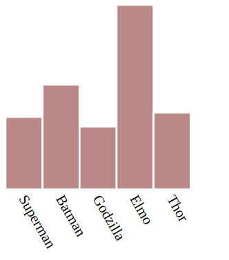

# bar-chart
Create a bar chart SVG

## Installation
`npm install @motardo/bar-chart`

## Basic Usage
```js
const barChart = require('@motardo/bar-chart');

const data = [3.14, 4.54, 2.72, 8, 3.33];
const config = {
  attributes: {
    chart: [
      /* the base image of the bars is 100 by 100 square
       * so this leaves some left and right padding and room
       * below for labels
       */
      'viewBox="0 0 120 240"',
    ],
  },
  labels: ['Superman', 'Batman', 'Godzilla', 'Elmo', 'Thor'],
  fill: ['#b88'],
};
const chart = barChart.svg(data, config);
```
The output is the `<svg>` string for drawing the chart. It will look like this:



## Express Demo
To run the demo:
```sh
git clone git@github.com:Motardo/bar-chart.git
cd bar-chart && npm install
node demo.js
```

And visit `localhost:3000` in a web browser to see the example chart.r
Note: You will want to resize the browser window to be quite narrow for the demo chart to display reasonably.

## API
The module exposes one method `svg` which takes an array of numbers for data to
construct the bar chart. An optional `config` object may be given as a second parameter.

### Config
Properties may include:
 - `attributes`: an object with three properties
   * `chart`: an array of attributes to include in the outer svg tag
   * `bars`: an array of attributes to apply to the bars as a group
   * `labels`: like `bars` but for the labels as a group
 - `fill`: an array of strings representing fill colors to cycle through for each bar (default is `["#ccc"]`)
 - `stroke`: like `fill`, but for the stroke colors
 - `labels`: an array of strings to label the data
 - `labelOptions`: an object to configure the label appearance
   * `fontSize`: default is `"10px"`
   * `rotate`: default is `60`
   * `padding`: default is `7`
